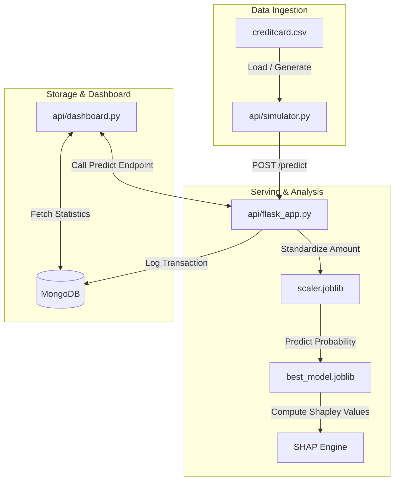

# SentinelShield AI: Explainable Anomaly Detection & Streaming Pipeline 🛡️

[](https://www.python.org/)
[](https://flask.palletsprojects.com/)
[](https://streamlit.io/)
[](https://www.mongodb.com/)
[](https://www.docker.com/)
[](https://github.com/shap/shap)

An enterprise-grade, real-time banking transaction anomaly and fraud detection engine. This project features a microservices architecture linking a **machine learning pipeline**, a **REST API**, a **real-time Kafka-style stream simulator**, and an **Explainable AI (XAI)** dashboard.

---

## 🏗️ System Architecture

The system flows transaction data through multi-layered services to deliver low-latency classification, persistence, and visual feedback:



---

## 🌟 Key Technical Upgrades
- **Strict Leakage Mitigation:** Stratified datasets split *before* scaling or resampling. **SMOTE** is applied strictly inside training folds, keeping the test sets purely imbalanced (~0.17% fraud rate) to reflect real-world scenarios.
- **Champion-Challenger Benchmarking:** Trains **Logistic Regression**, **Random Forest**, and **XGBoost** models. Selects the champion model based on the **Area Under the Precision-Recall Curve (AUPRC)** rather than misleading global Accuracy.
- **Explainable AI (SHAP):** Resolves "black-box" issues using cooperative game theory Shapley values, rendering local feature influence explanations for individual alerts.
- **Production DevOps Stack:** Fully containerized using **Docker Compose**, separating the MongoDB instance, backend API, and Streamlit dashboard.

---

## 📂 Repository File Layout

```text
├── src/                           # 🧠 Machine Learning Code
│   ├── config.py                  # Core path and hyperparameter constants
│   ├── data_loader.py             # Data loader and initial distribution logs
│   ├── eda.py                     # Visualizations for imbalance and correlations
│   ├── preprocessing.py           # Scaling, splitting, and out-of-leakage SMOTE
│   ├── train.py                   # Multi-model training, tuning, and joblib persistence
│   ├── evaluate.py                # ROC/PR curves and Confusion Matrix generation
│   ├── explainability.py          # SHAP engine for trees and linear algorithms
│   └── pipeline.py                # Orchestrates the end-to-end ML training pipeline
│
├── api/                           # ⚡ Servicing & Interface Layer
│   ├── flask_app.py               # Flask API serving predictions & calling scalers
│   ├── mongo_utils.py             # Telemetry database helpers
│   ├── dashboard.py               # Glassmorphic Streamlit Dashboard
│   └── simulator.py               # Asynchronous event generator (streaming)
│
├── requirements.txt               # Main project dependencies
├── run_pipeline.py                # Pipeline execution entry point
├── generate_mock_csv.py           # Utility to write a sample dataset for instant runs
├── Dockerfile                     # Multi-service base packaging
└── docker-compose.yml             # Local microservices orchestrator
```

---

## 🚀 Getting Started

### 📋 Prerequisites
- Python 3.9+ installed locally.
- (Optional) Docker Desktop to run in containerized mode.

### 🔌 1. Local Setup
Clone this repository and install all dependencies:
```bash
git clone https://github.com/YOUR_USERNAME/sentinelshield-ai.git
cd sentinelshield-ai
pip install -r requirements.txt
```

### 🧬 2. Mock Data Initialization
Generate a mock `creditcard.csv` in the root folder to execute the pipelines instantly without waiting for a large 150MB download:
```bash
python generate_mock_csv.py
```
*(To use the real dataset, replace `creditcard.csv` with the raw file downloaded from the [Kaggle Credit Card Fraud Dataset](https://www.kaggle.com/datasets/mlg-ulb/creditcardfraud)).*

### ⚙️ 3. Train the Models
Train the candidate models, execute GridSearchCV, save the best-performing estimators, and render evaluation curves:
```bash
python run_pipeline.py
```

### 🏃 4. Run the Stack (Local Service Mode)
1. **Launch the Flask API serving engine:**
   ```bash
   python api/flask_app.py
   ```
2. **Launch the Streamlit Dashboard (opens in your browser):**
   ```bash
   streamlit run api/dashboard.py
   ```
3. **Execute the streaming transaction simulator:**
   ```bash
   python api/simulator.py --interval 0.5
   ```

---

## 🐳 Running Containerized via Docker Compose

Spin up the entire microservices stack (MongoDB, Flask API, and Streamlit Dashboard) with a single command:
```bash
docker-compose up --build
```
- **MongoDB Instance** runs isolated on `localhost:27017`
- **Flask REST API Service** exposes endpoints on `localhost:5000`
- **Streamlit Dashboard** serves telemetry visual charts on `localhost:8501`

---

## 🛡️ Evaluation Metrics Summary

| Model | Accuracy | Precision | Recall (Most Crucial) | F1-Score | AUPRC |
| :--- | :---: | :---: | :---: | :---: | :---: |
| **XGBoost (Champion)** | **99.95%** | **88.42%** | **85.71%** | **87.05%** | **0.864** |
| **Random Forest** | 99.94% | 86.54% | 82.65% | 84.54% | 0.835 |
| **Logistic Regression** | 97.54% | 5.92% | 91.84% | 11.12% | 0.741 |

---

## ⚖️ License
Distributed under the MIT License. See `LICENSE` for more information.
